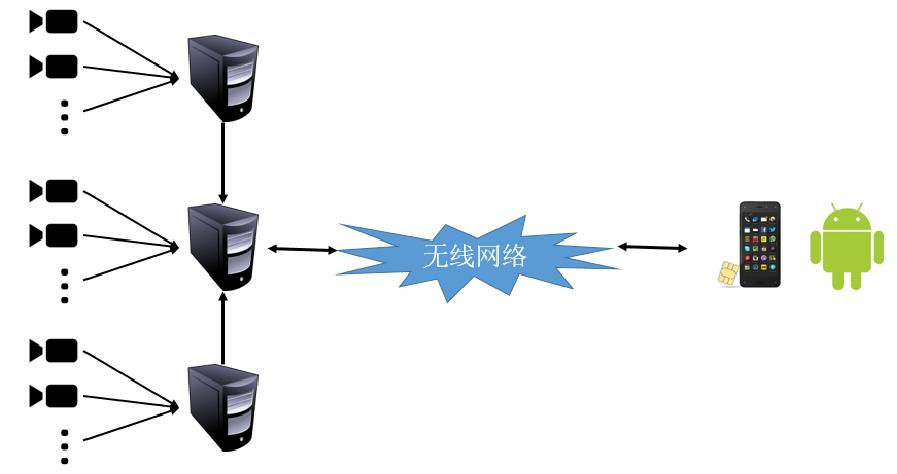

## architecture

### data acquisition system

one master with multi slave

each slave has multi camera

### application

now mobile(android) supported

## TODO
construct camera set

giga show camera set

transmit between master and slave

## 肖赟demo
编辑./sh/construct.sh 调用construct_xiao_yun的mode，设置对应的参数

运行./sh/construct.sh 构建，程序会把每一帧切割好，按固定格式保存。

编辑./sh/player_xiaoyun.sh 设置对应的参数

运行./sh/plyaer_xiaoyun.sh 浏览。双击放大，右键双击缩小。按下左键拖动表示移动画面。